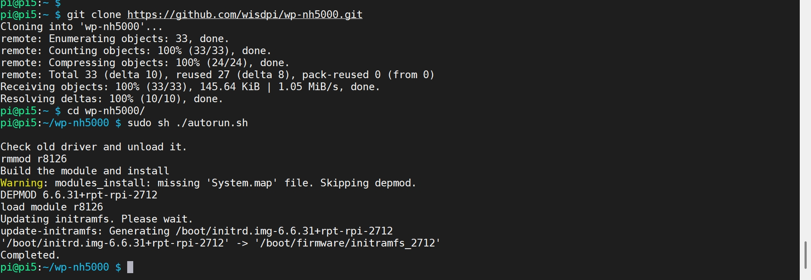
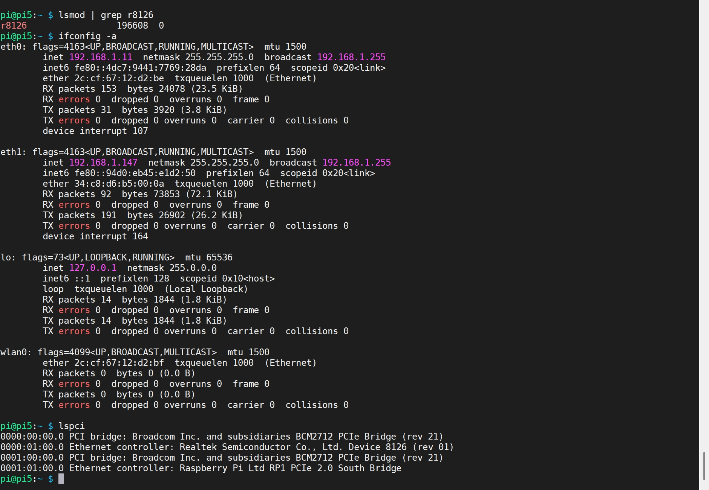

# WP-NH5000(P) driver for Raspberry Pi 5

This is the driver released for WisdPi Raspberry Pi 5GbE expanision board with PCIe interface.

## Requirements
- Raspberry Pi 5
- Raspberry Pi OS (Kernel version: 6.6)
- WP-NH5000 or WP-NH5000P
## Quick install

1. Clone the code :
`git clone https://github.com/wisdpi/wp-nh5000.git`
2. Change to the directory:
`cd wp-nh5000`
3. If you are running the target kernel, then you should be able to do :
`sudo sh ./autorun.sh`
4. Reboot:
`sudo reboot`
5. You can check whether the driver is loaded by using following commands.

```
lsmod | grep r8126
ifconfig -a
```


## Set the network
### Force the link status when insert the driver.
If the user is in the path ~/r8126, the link status can be forced to one of the 5 modes as following command.
`sudo insmod ./src/r8126.ko speed=SPEED_MODE duplex=DUPLEX_MODE autoneg=NWAY_OPTION`
- SPEED_MODE	= 1000	for 1000Mbps
                = 100	for 100Mbps
                = 10	for 10Mbps
- DUPLEX_MODE	= 0	for half-duplex
                = 1	for full-duplex
- NWAY_OPTION	= 0	for auto-negotiation off (true force)
                = 1	for auto-negotiation on (nway force)

For example:
`sudo insmod ./src/r8126.ko speed=100 duplex=0 autoneg=1`

will force PHY to operate in 100Mpbs Half-duplex(nway force).

### Force the link status by using ethtool.
1. Insert the driver first.
2. Make sure that ethtool exists in /sbin.
3. Force the link status as the following command.
```
ethtool -s eth1 autoneg on advertise 0x80000000002f (2.5G)
ethtool -s eth1 autoneg on advertise 0x002f (1G)
ethtool -s eth1 autoneg on advertise 0x000f (100M full)
ethtool -s eth1 autoneg on advertise 0x0003 (10M full)
```
			
### Jumbo Frame
Transmitting Jumbo Frames, whose packet size is bigger than 1500 bytes, please change mtu by the following command.
`ifconfig ethX mtu MTU`
where X=0,1,2,..., and MTU is configured by user.

RTL8126 supports Jumbo Frame size up to 9 kBytes.

### EEE
#### Get EEE device status
`ethtool --show-eee eth1`

#### Set EEE device status
```
ethtool --set-eee eth1 eee on tx-lpi on tx-timer 1546 advertise 0x0008 (100M full)
ethtool --set-eee eth1 eee on tx-lpi on tx-timer 1546 advertise 0x0020 (1G)
ethtool --set-eee eth1 eee on tx-lpi on tx-timer 1546 advertise 0x8000 (2.5G)
```